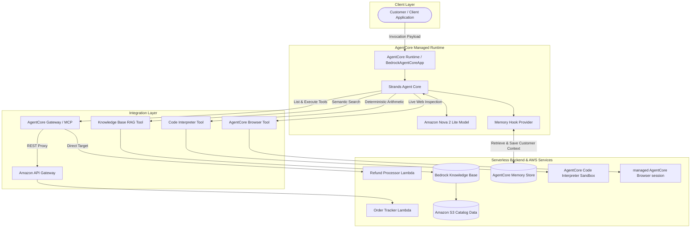
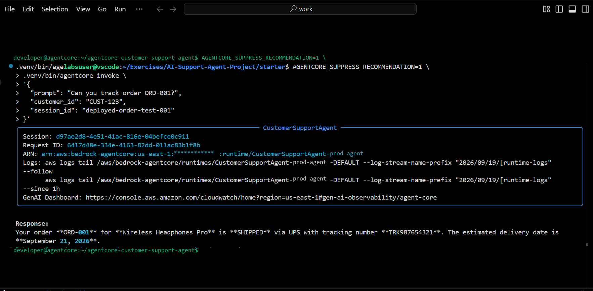
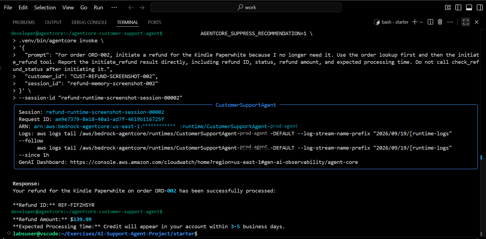
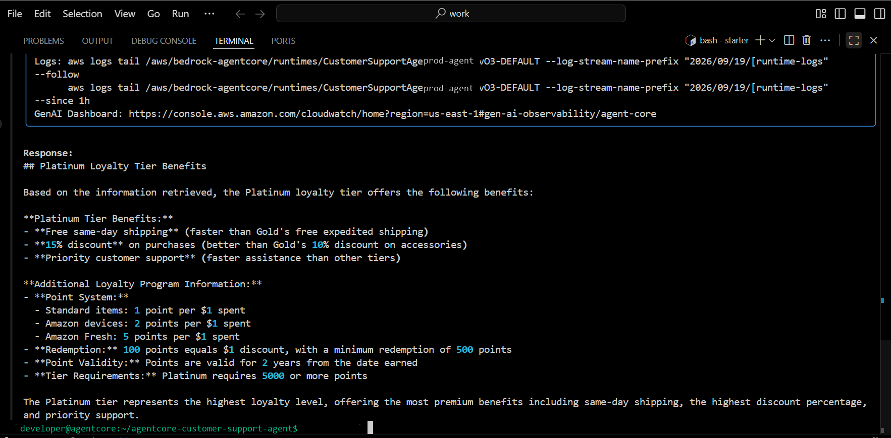
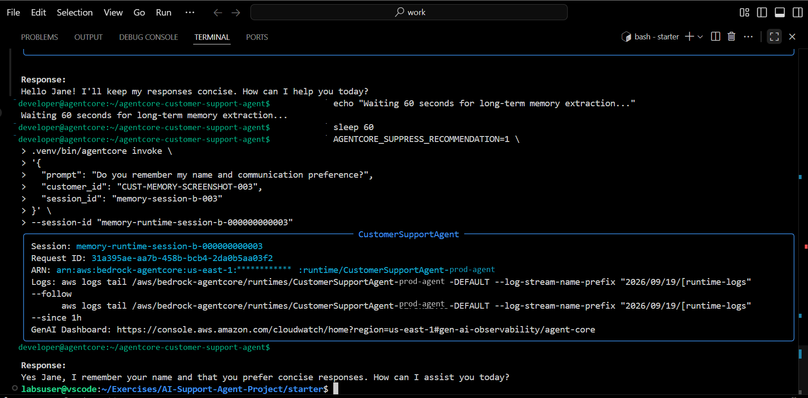
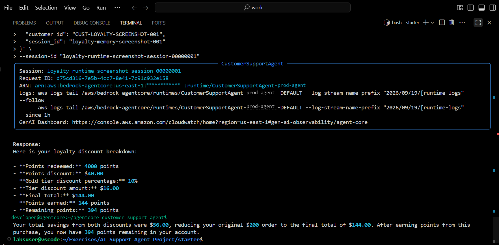
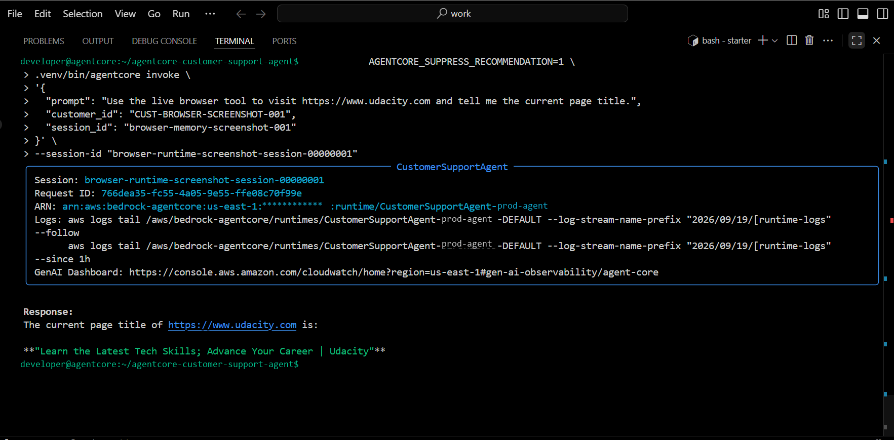

# AWS AgentCore Customer Support Agent

A multi-capability AI customer-support system built with **Amazon Bedrock AgentCore**, **Strands Agents**, **AgentCore Gateway (MCP)**, **Amazon Bedrock Knowledge Bases**, and **AgentCore Memory**.

The system demonstrates a single-agent, multi-tool architecture that unifies tool execution, semantic document retrieval (RAG), cross-session customer memory, sandboxed deterministic computation, live browser automation, and serverless backend integrations into a robust customer-facing agent.

---

## Architecture

The project employs a **single-agent, multi-tool architecture**. The central agent is powered by **Amazon Nova 2 Lite** (`global.amazon.nova-2-lite-v1:0`) and orchestrated through the **Strands Agents** framework running on the **Amazon Bedrock AgentCore Runtime**.



---

## Core Capabilities

The customer support agent implements and verifies six distinct capabilities:

1. **Order Tracking**: Looks up order status, carrier and shipment status, estimated delivery dates, and customer purchase history from the sample customer/order backend via the AgentCore Gateway.
2. **Refund Processing**: Structured refund initiation, approval response, unique refund ID generation, refund status lookup, and simulated return-label generation via AWS Lambda.
3. **Knowledge-Base RAG**: Retrieves accurate product specifications, return windows, warranty details, and store policies from an Amazon Bedrock Knowledge Base backed by Amazon S3.
4. **Cross-Session Long-Term Memory**: Automatically extracts and persists customer facts and user preferences across separate runtime sessions using AgentCore Memory.
5. **Deterministic Loyalty Calculations**: Uses AgentCore Code Interpreter to execute exact arithmetic for multi-tier discounts, points redemption, and reward accrual in a secure Python sandbox.
6. **Live Web Browsing**: Accesses external, real-time web resources on demand using AgentCore Browser to verify external URLs and live page details.

---

## How It Works

Each component in the architecture has a strictly separated responsibility:

| Component | Role & Technical Responsibility |
| :--- | :--- |
| **AgentCore Runtime** | Hosts the AgentCore-hosted application (`BedrockAgentCoreApp`), manages request lifecycle, and coordinates session tokens. |
| **Foundation Model (Amazon Nova 2 Lite)** | Evaluates customer prompts, reasons over conversation context, performs multi-turn tool calling, and generates grounded customer responses. |
| **AgentCore Gateway / MCP** | Decouples backend tools from the agent using the Model Context Protocol (MCP). Dynamically advertises tool schemas to the model over HTTP streamable connections. |
| **Bedrock Knowledge Base** | Indexes unstructured store documentation (`data/product_catalog.txt`) and performs vector retrieval to ground answers in factual policies. |
| **AgentCore Memory** | Observes user and assistant messages via Strands event hooks (`MessageAddedEvent`, `AfterInvocationEvent`), retrieving semantic customer context and recording interactions. |
| **Code Interpreter** | Runs an isolated Python execution environment for loyalty discount math, reducing reliance on LLM arithmetic. Includes automatic local fallback logic. |
| **AgentCore Browser** | Manages ephemeral, sandboxed browser sessions to fetch live web page content when requested. |
| **AWS Lambda** | Implements the core business logic for order queries (`order_tracker.py`) and refund actions (`refund_processor.py`). |
| **Amazon API Gateway** | Acts as the REST proxy layer between the AgentCore Gateway and the order tracking Lambda microservice. |

---

## Example Scenarios

The agent handles complex customer support interactions across diverse operational modes:

### Scenario 1: Order Tracking via MCP Gateway

```text
Customer: "Can you track order ORD-001?"
Agent: "Your order ORD-001 for Wireless Headphones Pro is SHIPPED via UPS with tracking number TRK987654321. The estimated delivery date is September 21, 2026."
```

*Tools used*: `orders___get_order` via AgentCore Gateway (routed through Amazon API Gateway to AWS Lambda).

### Scenario 2: Refund Processing

```text
Customer: "For order ORD-002, initiate a refund for the Kindle Paperwhite because I no longer need it. Report the initiate_refund result directly."
Agent: "Your refund for the Kindle Paperwhite on order ORD-002 has been successfully processed:
- Refund ID: REF-FIFZH5YR
- Status: APPROVED
- Refund Amount: $139.99
- Expected Processing Time: Credit will appear in your account within 3-5 business days."
```

*Tools used*: `refunds___initiate_refund` via AgentCore Gateway (direct AWS Lambda execution).

### Scenario 3: Grounded Knowledge Retrieval (RAG)

```text
Customer: "What are the benefits for Platinum tier loyalty members?"
Agent: "Platinum loyalty tier offers the following benefits:
- Free same-day shipping (faster than Gold's free expedited shipping)
- 15% discount on purchases (better than Gold's 10% discount on accessories)
- Priority customer support (faster assistance than other tiers)"
```

*Tools used*: `search_knowledge_base` querying the Bedrock Knowledge Base backed by Amazon S3.

### Scenario 4: Cross-Session Customer Memory

**Session A (Preference Stored):**

```text
Customer: "Hi, I am Jane. I prefer concise responses."
Agent: "Hello Jane! I'll keep my responses concise. How can I help you today?"
```

*Action*: Memory hook records Jane's name in `SEMANTIC` facts and preference for brevity in `USER_PREFERENCE`.

**Session B (Different Runtime Session, Same Customer ID):**

```text
Customer: "Do you remember my name and communication preference?"
Agent: "Yes Jane, I remember your name and that you prefer concise responses. How can I assist you today?"
```

*Action*: Pre-invocation hook automatically fetches customer context from AgentCore Memory; the agent honors the concise preference without re-prompting.

### Scenario 5: Deterministic Loyalty Calculation

```text
Customer: "Calculate my loyalty discount for a $200 order. I have 4,250 points and I am Gold tier."
Agent: "Here is your loyalty discount breakdown:
- Points redeemed: 4,000 points
- Points discount: $40.00
- Gold tier discount percentage: 10%
- Tier discount amount: $16.00
- Final total: $144.00
- Points earned: 144 points
- Remaining points: 394 points
Your total savings from both discounts were $56.00, reducing your original $200 order to the final total of $144.00."
```

*Tools used*: `calculate_loyalty_discount` via AgentCore Code Interpreter sandbox.

### Scenario 6: Live Web Retrieval

```text
Customer: "Use the live browser tool to visit https://www.udacity.com and tell me the current page title."
Agent: "The current page title of https://www.udacity.com is: 'Learn the Latest Tech Skills; Advance Your Career | Udacity'"
```

*Tools used*: `AgentCoreBrowser` browser tool.

---

## Validated Scenarios

The capabilities of this agent were validated end-to-end against live AWS infrastructure in a deployed AgentCore Runtime environment. The following scenarios were exercised:

- **Gateway Tool Invocation**: Verified dynamic MCP discovery and successful tool routing over streamable HTTP to AWS Lambda and Amazon API Gateway.
- **Refund Processing**: Confirmed MCP tool routing, Lambda invocation, unique refund ID generation, structured approval responses, refund status lookup, and simulated return-label generation.
- **Knowledge Base RAG**: Verified semantic vector retrieval over product specs, return windows, and loyalty tiers from Amazon S3-backed Knowledge Bases.
- **Cross-Session Memory**: Verified multi-turn persistence across independent session IDs using AgentCore Memory strategies (`SEMANTIC` facts and `USER_PREFERENCE`).
- **Code Interpreter Execution**: Validated deterministic Python execution in a managed isolated execution environment with a functionally equivalent local arithmetic fallback.
- **AgentCore Browser**: Validated sandboxed headless browser initialization and live web page extraction.
- **Deployed Runtime**: Verified execution on AWS Bedrock AgentCore Runtime with CloudWatch logging and observability.

> [!NOTE]
> These validated scenarios represent end-to-end integration verifications performed on live AWS AgentCore infrastructure. They are distinct from the offline unit test suite in `tests/`.

---

## Verified Execution

Sanitized execution evidence captured from the live Amazon Bedrock AgentCore deployment environment:

### 1. Order Tracking via MCP Gateway

Carrier and shipment status lookup via AgentCore Gateway and Amazon API Gateway (sample order backend):



### 2. Refund Processing via AWS Lambda

Structured refund initiation, approval response, and refund ID generation via AWS Lambda:



### 3. Knowledge-Base RAG Retrieval

Semantic document search across product catalog and store policies via Amazon Bedrock Knowledge Base:



### 4. Cross-Session Customer Memory Recall

Long-term customer memory extraction and cross-session retrieval using AgentCore Memory:



### 5. Deterministic Loyalty Calculation

Sandboxed Python execution via AgentCore Code Interpreter reducing reliance on LLM arithmetic:



### 6. Live Web Browsing via AgentCore Browser

Sandboxed browser automation and live webpage title retrieval:



---

## Repository Structure

```text
agentcore-customer-support-agent/
├── README.md                  # Comprehensive portfolio documentation
├── main.py                    # AgentCore application entrypoint & tool definitions
├── pyproject.toml             # Project metadata, dependencies, and build configuration
├── requirements.txt           # Locked deployment dependencies
├── uv.lock                    # Exact dependency lockfile
├── .env.example               # Configuration template with non-sensitive placeholders
├── .gitignore                 # Exclusion rules for secrets, caches, and virtualenvs
│
├── .github/
│   └── workflows/
│       └── ci.yml             # GitHub Actions CI workflow (syntax & offline tests)
│
├── data/
│   └── product_catalog.txt    # Canonical product catalog & policy reference for RAG
│
├── docs/
│   ├── architecture.md        # Technical architecture deep dive & sequence diagrams
│   └── images/                # Sanitized execution evidence screenshots
│
├── lambda/
│   ├── order_tracker.py       # Order & customer lookup Lambda (API Gateway proxy)
│   ├── refund_processor.py    # Refund management Lambda (AgentCore Gateway target)
│   └── lambda_schema.json     # Declarative JSON schema for Gateway tool parameters
│
└── tests/
    ├── test_lambda_handlers.py # Offline unit tests for Lambda backend handlers & routing
    └── test_loyalty.py        # Offline unit tests for loyalty calculation business logic
```

---

## Configuration

The project uses environment variables for all environment-specific and infrastructure identifiers.

Copy the example template to `.env`:

```bash
cp .env.example .env
```

### Environment Variables

| Variable | Description | Required | Default |
| :--- | :--- | :---: | :--- |
| `AWS_REGION` | Target AWS region | No | `us-east-1` |
| `BEDROCK_MODEL_ID` | Foundation model ID | No | `global.amazon.nova-2-lite-v1:0` |
| `AGENTCORE_GATEWAY_URL` | AgentCore Gateway endpoint for MCP tool execution | Yes (for tools) | `""` |
| `BEDROCK_KNOWLEDGE_BASE_ID` | Amazon Bedrock Knowledge Base ID for RAG | Yes (for RAG) | `""` |
| `AGENTCORE_MEMORY_ID` | AgentCore Memory ID for cross-session state | Yes (for memory) | `""` |

> [!IMPORTANT]
> Never commit `.env` or any file containing real AWS resource identifiers to version control. The repository's `.gitignore` explicitly prevents `.env` tracking.

---

## Local Development & Testing

### Prerequisites

- Python >= 3.10 (validated with Python 3.13 in AgentCore runtime and Python 3.14 locally)
- AWS CLI configured with appropriate credentials (if connecting to AWS services)
- `uv` (recommended) or `pip`

### 1. Environment Setup

Using `uv`:

```bash
# Create and activate virtual environment
uv venv
source .venv/bin/activate  # On Windows: .venv\Scripts\activate

# Install dependencies from lockfile
uv sync
```

Using standard `pip`:

```bash
python -m venv .venv
source .venv/bin/activate  # On Windows: .venv\Scripts\activate
pip install -r requirements.txt
```

### 2. Run Local Unit Tests

The repository includes a standalone unit test suite validating the backend Lambda handlers and routing logic without calling live AWS services:

```bash
python -m unittest discover -s tests -v
```

### 3. Local Runtime Server

To run the local AgentCore application server:

```bash
python main.py
```

---

## AWS Deployment

Deployment to Amazon Bedrock AgentCore Runtime utilizes the AgentCore CLI and starter toolkit:

> [!NOTE]
> AgentCore deployment requires local AgentCore project configuration. Generated runtime/deployment configuration files are intentionally excluded from version control because they contain environment-specific infrastructure metadata.

```bash
# Deploy the agent container to AgentCore Runtime
agentcore deploy

# Invoke the deployed agent on AgentCore Runtime
agentcore invoke '{"prompt": "What is the return window for electronics?", "customer_id": "CUST-123"}'
```

### Infrastructure Provisioning Notes

- The core agent container is deployed via `agentcore deploy` using `main.py` as the entrypoint.
- Supporting AWS infrastructure (AgentCore Gateway, API Gateway, Lambda functions, Knowledge Base, and Memory) can be provisioned through the AWS Management Console or AWS CloudFormation/CDK.
- The `lambda/` directory contains deployable Lambda code:
  - Package `order_tracker.py` and attach to an Amazon API Gateway REST API.
  - Package `refund_processor.py` and configure as a direct Lambda target in AgentCore Gateway using `lambda/lambda_schema.json`.
  - Upload `data/product_catalog.txt` to an Amazon S3 bucket connected to an Amazon Bedrock Knowledge Base.

---

## Security & Production Considerations

### Implemented Safeguards

- **Zero Secrets in Source**: All endpoints, resource identifiers, and credentials are externalized to environment variables.
- **Isolated Execution**: Deterministic calculations run in a managed isolated execution environment via AgentCore Code Interpreter.
- **Safe Fallback**: If the Code Interpreter service is unreachable, the tool gracefully falls back to deterministic local calculation (`calculate_loyalty_values`) preserving identical business calculations.
- **Customer Memory Partitioning**: Long-term memories are partitioned by customer actor ID and strategy namespaces (`cs_agent/{actorId}/facts`, `cs_agent/{actorId}/preferences`), providing application-level separation of customer memory records.

### Recommended Production Enhancements

- **Gateway Authentication**: Enforce mTLS or IAM SigV4 authentication on the AgentCore Gateway endpoint.
- **Least-Privilege IAM**: Restrict the agent's IAM execution role to specific Bedrock model ARNs, Knowledge Base IDs, and Memory resources.
- **Prompt-Injection Defense**: Implement dedicated Bedrock Guardrails or input filtering layers to detect and intercept prompt injection attempts before agent execution.
- **Rate Limiting & Abuse Prevention**: Implement Amazon API Gateway usage plans and throttling limits for customer endpoints.
- **Comprehensive Observability**: Stream structured AgentCore invocation metrics and tool traces to Amazon CloudWatch and AWS X-Ray.
- **Production Persistence**: Migrate the Lambda sample databases to Amazon DynamoDB with encryption at rest and point-in-time recovery.

---

## Engineering Decisions

1. **Decoupling Tools via Model Context Protocol (MCP)**:
   By utilizing the AgentCore Gateway as an MCP server, the agent core does not need direct database connectors or hardcoded REST clients. Backend tools are discovered and updated independently of agent releases.

2. **Decoupling Long-Term Memory from Session State**:
   Runtime conversation history handles immediate multi-turn context, whereas AgentCore Memory manages cross-session semantic facts and user preferences. Memory extraction is asynchronous, decoupling fast response generation from heavy fact extraction.

3. **Deterministic Math via Code Interpreter**:
   Rather than relying on the LLM's internal weights to compute multi-tier discounts and points conversions, the agent uses Code Interpreter for deterministic execution of explicit Python business logic that reduces arithmetic errors and avoids relying on the LLM for calculations, supported by a functionally equivalent local fallback.

4. **Grounding Knowledge via RAG vs. System Prompts**:
   Store policies and product specifications are retrieved dynamically from Bedrock Knowledge Bases rather than stuffed into system prompts. This reduces prompt token costs and ensures catalog updates take effect immediately without redeploying the agent.

5. **On-Demand Browser Access**:
   AgentCore Browser is configured as an explicit tool invoked only when real-time web retrieval is requested, minimizing external latency and resource overhead.

---

## Technology Stack

- **Language & Runtime**: Python (>=3.10; validated with Python 3.13 and Python 3.14)
- **Agent Orchestration**: Amazon Bedrock AgentCore, Strands Agents SDK
- **Foundation Model**: Amazon Nova 2 Lite (`global.amazon.nova-2-lite-v1:0`) via Amazon Bedrock
- **Tool Protocols**: Model Context Protocol (MCP), Streamable HTTP Client
- **RAG & Knowledge Retrieval**: Amazon Bedrock Knowledge Bases, Amazon S3
- **Persistent Memory**: Amazon Bedrock AgentCore Memory (Semantic & User Preference strategies)
- **Code Execution**: Amazon Bedrock AgentCore Code Interpreter
- **Web Automation**: Amazon Bedrock AgentCore Browser
- **Serverless Compute**: AWS Lambda, Amazon API Gateway
- **AWS SDK**: Boto3, `bedrock-agentcore`, `bedrock-agentcore-starter-toolkit`

## Attribution

This project builds on the foundational starter assets from Udacity's
`cd14763-project-starter`.

The agent orchestration, AgentCore integrations, MCP tooling, RAG integration,
long-term memory, Code Interpreter workflow, Browser integration, deployment,
testing, configuration refactoring, architecture documentation, and portfolio
implementation in this repository were developed and validated as part of my
engineering work.

Original educational starter assets remain subject to their respective
upstream license terms.
