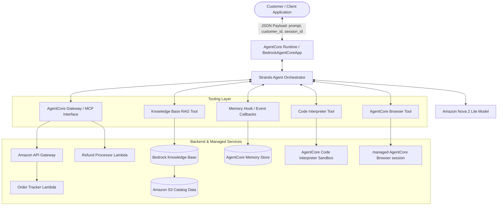
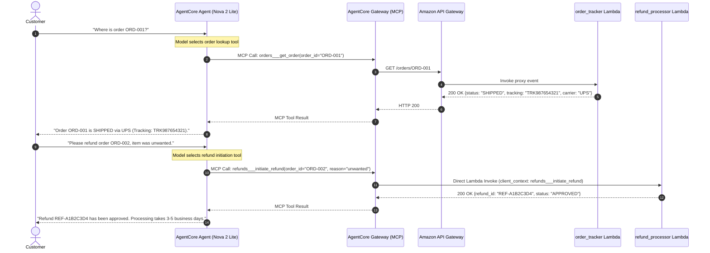
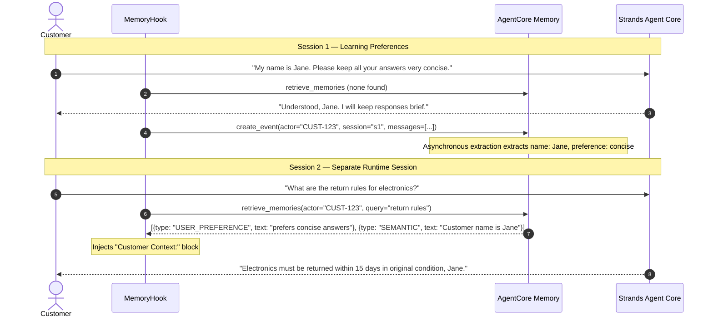

# Architecture Deep Dive: AWS Bedrock AgentCore Customer Support Agent

This document provides a technical architecture overview of the **AWS Bedrock AgentCore Customer Support Agent**, detailing its single-agent, multi-tool design, decoupled component boundaries, protocol specifications, and security model.

---

## 1. Architectural Paradigm

The system implements a **single-agent, multi-tool / multi-capability architecture** powered by **Amazon Bedrock AgentCore** and the **Strands Agents** SDK. Rather than deploying fragmented, competing sub-agents, a unified reasoning core (`global.amazon.nova-2-lite-v1:0`) orchestrates specialized toolsets across distinct operational boundaries:

---

## 2. Component Breakdown

### 2.1 AgentCore Runtime & Application Server (`BedrockAgentCoreApp`)

- **Hosting Model**: Deployed as an AgentCore-hosted application on Amazon Bedrock AgentCore Runtime.
- **Entrypoint**: Decorated with `@app.entrypoint` accepting asynchronous invocation payloads containing `prompt`, `customer_id`, and `session_id`.
- **Stateless Execution**: The runtime processes requests statelessly; session persistence is maintained externally via AgentCore Memory and runtime session tags.

### 2.2 Foundation Model Orchestrator

- **Model**: Amazon Nova 2 Lite (`global.amazon.nova-2-lite-v1:0`) via `BedrockModel`.
- **Responsibilities**: Intent resolution, multi-step tool call generation, argument synthesis, and final customer response formulation.
- **System Prompt Rules**: Enforces strict grounding, prohibiting fabrication of order numbers, refund statuses, tracking codes, or policy guidelines.

### 2.3 AgentCore Gateway via Model Context Protocol (MCP)

- **Protocol**: MCP Streamable HTTP Client (`streamable_http_client`).
- **Decoupling Rationale**: Backend business systems (order databases, payment gateways, CRM tools) are not baked directly into the agent runtime. Instead, the AgentCore Gateway exposes standardized MCP tool definitions discovered dynamically at invocation time via `mcp_client.list_tools_sync()`.
- **Target Routing**:
  - `orders` target: Routes REST requests through Amazon API Gateway to the `order_tracker` Lambda function (`GET /orders/{order_id}`, `GET /customers/{customer_id}/orders`, `GET /customers/{customer_id}`).
  - `refunds` target: Invokes the `refund_processor` Lambda function directly (`initiate_refund`, `check_refund_status`, `get_return_label`).

### 2.4 Serverless Microservices (`lambda/`)

1. **Order Tracker (`lambda/order_tracker.py`)**:
   - API Gateway proxy integration.
   - Extracts URL parameters and resource routes.
   - Simulates order tracking, carrier assignment, and customer tier metadata.
2. **Refund Processor (`lambda/refund_processor.py`)**:
   - Direct Gateway Lambda target invocation.
   - Parses `bedrockAgentCoreToolName` from `context.client_context.custom`.
   - Generates unique refund IDs (`REF-XXXXXXXX`), returns structured approval responses, supports refund status checks, and issues simulated return label URLs.
   - Tool interface schema defined in `lambda/lambda_schema.json`.

### 2.5 Knowledge Base Retrieval-Augmented Generation (RAG)

- **Data Source**: Product catalog, return windows, refund timelines, and loyalty rules (`data/product_catalog.txt`) synchronized to Amazon S3.
- **Retrieval Engine**: Amazon Bedrock Knowledge Base using managed semantic search (`_bedrock_runtime.retrieve`).
- **Tool Implementation**: `search_knowledge_base` extracts top-5 chunks and injects them into context with structured delimiters (`---`).

### 2.6 Cross-Session Long-Term Memory (`MemoryHook`)

- **Service**: Amazon Bedrock AgentCore Memory.
- **Strategies**:
  - `SEMANTIC`: Dynamic customer facts extracted from conversation history (e.g., purchased products, stated interests).
  - `USER_PREFERENCE`: Explicit interaction preferences (e.g., "keep responses concise", "prefer email receipts").
- **Hook Lifecycle**:
  - `MessageAddedEvent`: Before model invocation, retrieves relevant memories for the customer (`actor_id`) matching the incoming user query and prepends a `Customer Context:` block to the message.
  - `AfterInvocationEvent`: After model response generation, asynchronously logs the completed conversation turn (`USER` query and `ASSISTANT` answer) to AgentCore Memory via `create_event`.
  - **Asynchronous Extraction**: Memory synthesis and strategy updates occur out-of-band in AgentCore's managed backend.

### 2.7 Deterministic Computation (`calculate_loyalty_discount`)

- **Service**: Amazon Bedrock AgentCore Code Interpreter.
- **Rationale**: Provides deterministic execution of explicit Python business logic that reduces arithmetic errors and avoids relying on the LLM for calculations.
- **Execution**: The tool constructs an exact Python script, dispatches it to `code_session(REGION).invoke("executeCode", ...)`, and executes within a managed isolated execution environment.
- **Graceful Degradation**: If the Code Interpreter service endpoint is unreachable or disabled, the tool automatically falls back to a deterministic local Python calculation (`calculate_loyalty_values`) that produces functionally identical business results.

### 2.8 Live Web Retrieval (`AgentCoreBrowser`)

- **Service**: Amazon Bedrock AgentCore Browser.
- **Scope**: Used strictly when the customer requests current external information (e.g., checking carrier tracking portals or external store URLs).
- **Session Control**: Manages sandboxed headless browser instances with sanitized session names.

---

## 3. Detailed Sequence Diagrams

### 3.1 Order Lookup & Refund Flow (via MCP Gateway)

---

### 3.2 Long-Term Memory Lifecycle Across Sessions

---

## 4. Security & Data Isolation Boundaries

1. **Decoupled Gateway Permissions**: The agent runtime does not require direct VPC access or database credentials; it communicates exclusively via HTTP to the AgentCore Gateway.
2. **Environment Variable Configuration**: Zero hard-coded infrastructure values. All ARNs, Gateway URLs, Knowledge Base IDs, and Memory IDs are injected at runtime via environment variables.
3. **Execution Sandbox**: The Code Interpreter runs arbitrary Python calculations in a managed isolated execution environment without access to the host agent container.
4. **Customer Memory Partitioning**: Memory namespaces are partitioned by strategy and customer actor ID (`cs_agent/{actorId}/facts`, `cs_agent/{actorId}/preferences`), providing application-level separation of customer memory records.
